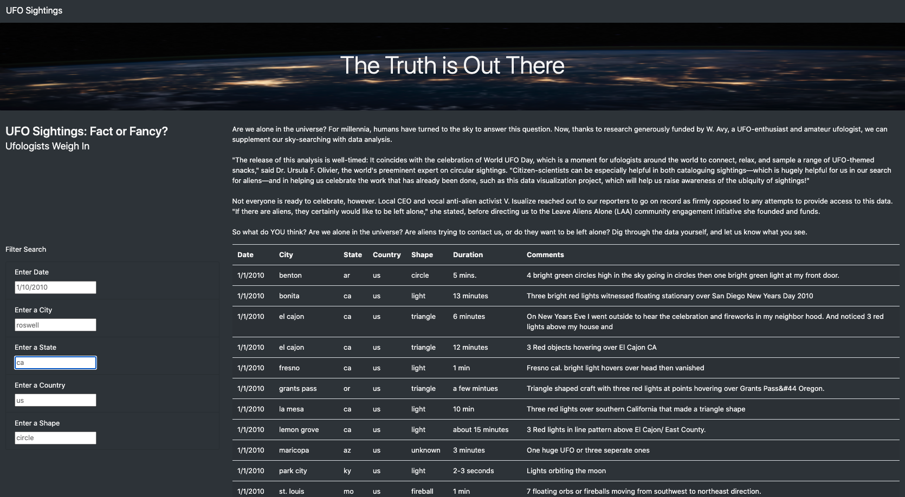
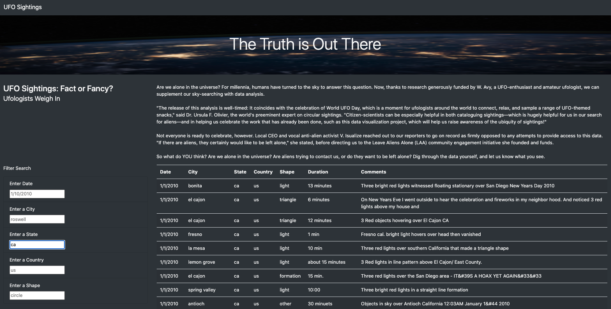
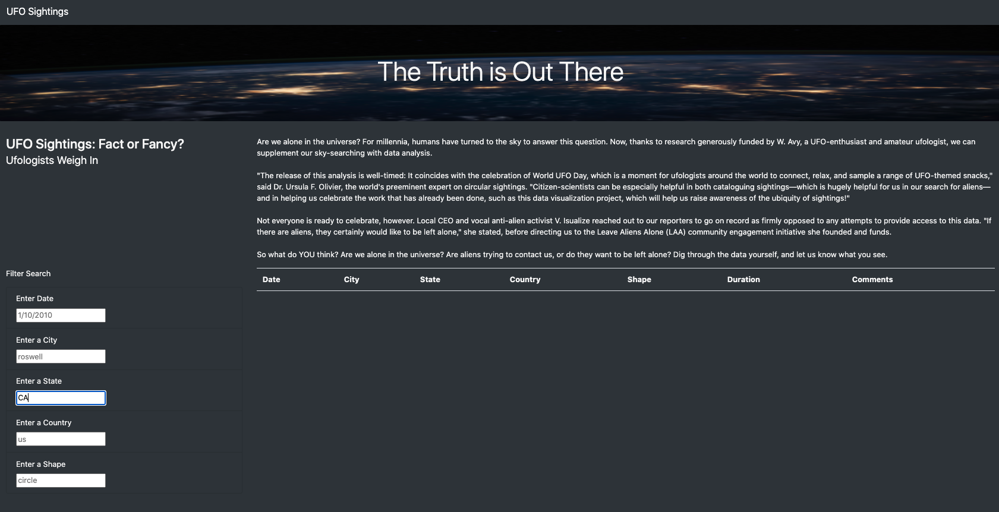

# UFOs

## Software
JavaScript, HTML, CSS

## Overview of Project

The purpose of the analysis is to create a webpage and dynamic table to provide a more in-depth analysis of UFO sightings by allowing users to filter for multiple criteria at the same time. We have added a table filters for the city, state, country, and shape.

# Results 

The user now able to look up specific data in the UFO table by using the provided filters (city, state, country, and shape). The user can input desired criteria in the search boxes then press enter to return the search results.

The image below shows the webpage and multiple criteria that the user can filter:

## Summary

### Drawback

One drawback of the webpage is that the search fields are case sensitive. For example, if a user searches for the UFO data by state by typing "CA", no results will be returned. However, if the user searches for lowercase "ca", various of results will be present.

The first image below shows the search results for UFO sightings in California when a search for "ca" is input:

The second image below shows the search results for UFO sightings in California when a search for "CA" is input:

### Further Recommendation

1. Adding code to return the result even if the exact search does not exist. It would be beneficial to be able to add spelling suggestion and correction to reduce confusion in the case of case and character sensitivity.

2. Add discalimer and limitation in the data table in order to ensure accuracy of the research. For example, we could add that the data is available for a certain year range.
